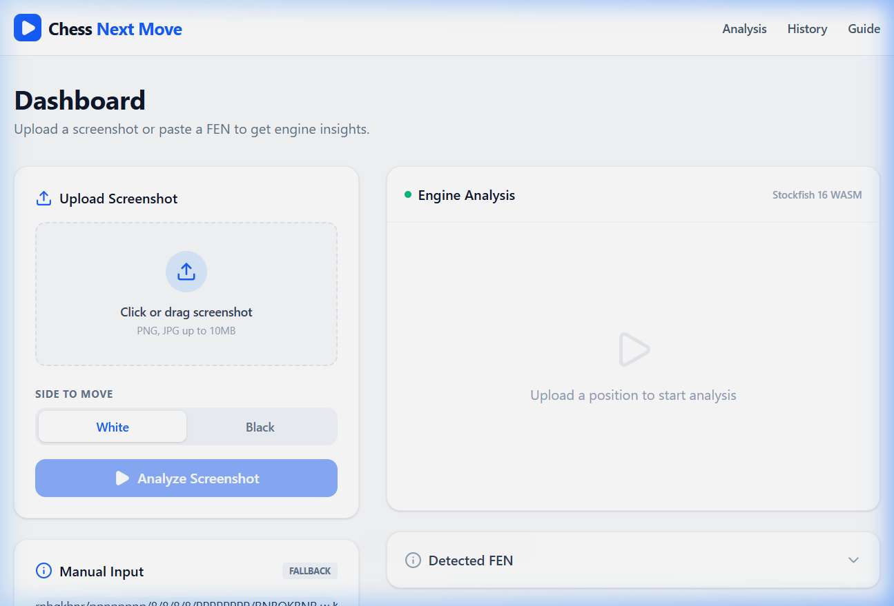

# Chess Next Move

<div align="center">
  
</div>

A modern, highly-modular web application designed to automatically analyze chess positions from screenshots and provide instant, accurate engine evaluations using Stockfish 16.

## 🚀 Features
- **Computer Vision Pipeline**: Uses a deterministic Python OpenCV microservice to perfectly extract FEN strings from standard chess.com screenshots. 
- **Local Engine Analysis**: Runs Stockfish 16 WASM directly in the browser via Web Workers for real-time, private, and lightning-fast evaluation.
- **Modern Clean Architecture**: The React frontend is broken out into granular custom hooks (`useChessEngine`, `useVisionAPI`) and isolated presentational components, fully adhering to the Single Responsibility Principle.

## 🏗️ Architecture Stack
* **Frontend**: React, TypeScript, Tailwind CSS, Framer Motion
* **Chess Logic**: `chess.js`, `react-chessboard`, `stockfish` (WASM)
* **Backend Gateway**: Node.js, Express, Vite
* **Vision Microservice**: Python, FastAPI, OpenCV (Template Matching)

---

## 💻 Running Locally

### 1. Start the Node.js / React Application
Ensure you have Node.js installed, then from the root directory run:
```bash
npm install
npm build
npm run start
```
*The web app will be available at `http://localhost:3000`.*

### 2. Start the Python Vision Microservice
Ensure you have Python 3.8+ installed. From the `vision-service/` directory, set up the virtual environment and start FastAPI:
```bash
cd vision-service
python -m venv venv
# Activate the venv (Windows: .\venv\Scripts\activate | Mac/Linux: source venv/bin/activate)
pip install -r requirements.txt
python main.py
```
*The vision API will be running on `http://127.0.0.1:5000`.*

---

## 🛠️ Usage
1. Open the application dashboard.
2. Ensure the "White" or "Black" side-to-move selector correctly matches the orientation of your screenshot.
3. Upload a standard 2D screenshot of a chess.com match into the dropzone.
4. Click **Analyze Screenshot**. The OpenCV engine will process the board layout, translate it to a FEN, and instantly spin up Stockfish to find your best next move!
